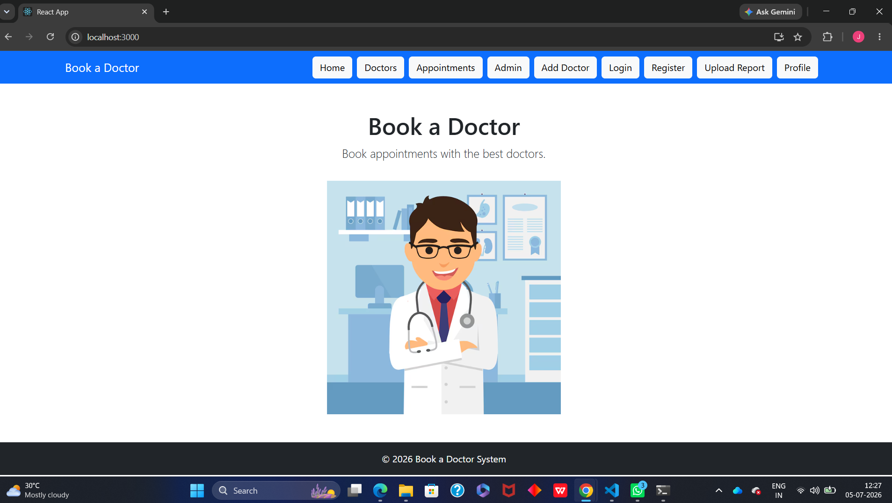
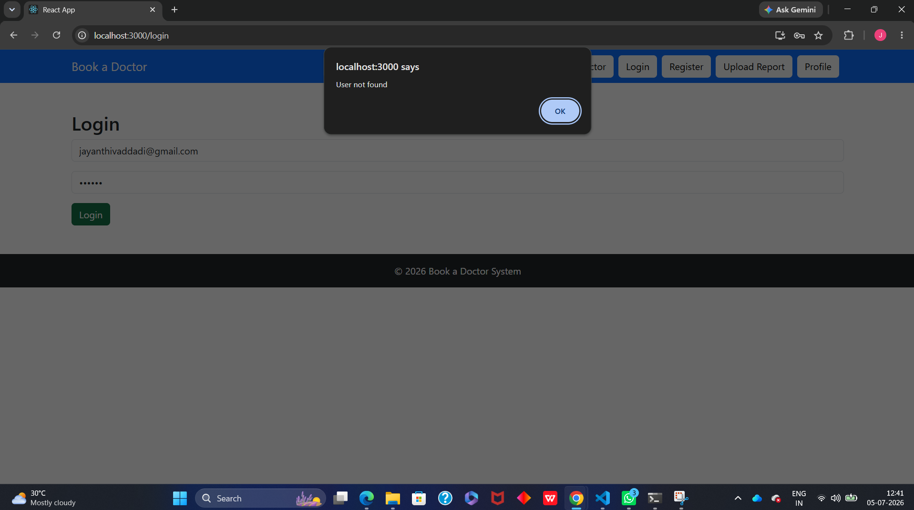
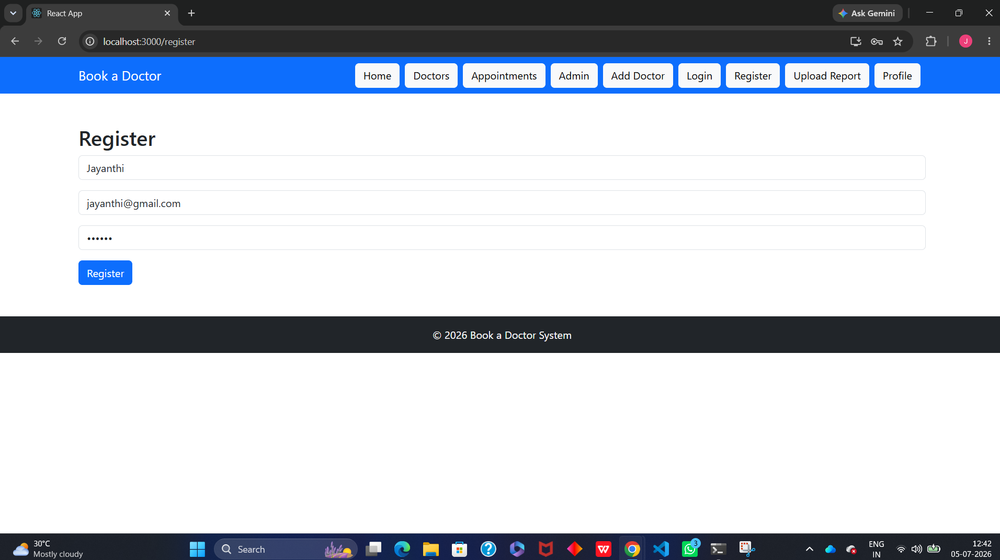
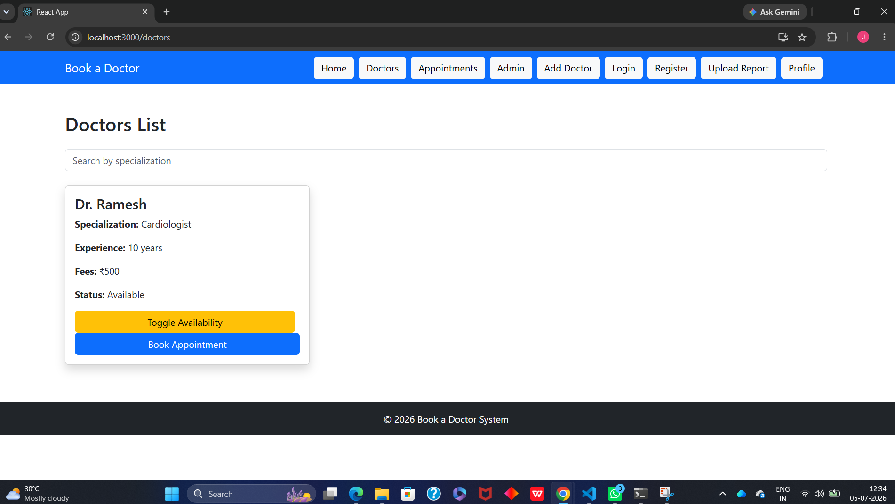
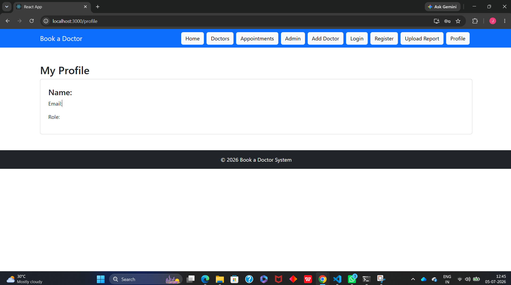
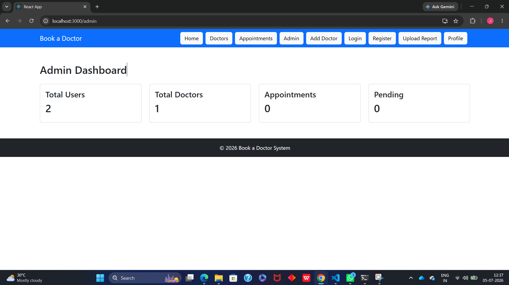

# 🩺 Book a Doctor

An online doctor appointment booking system built using the MERN stack. This application allows patients to register, log in, view doctors, book appointments, and manage their appointments easily.

---

## 🚀 Features

### 👤 Authentication
- User Registration
- User Login
- JWT Authentication
- Protected Routes

### 👨‍⚕️ Doctor Management
- View all doctors
- Search doctors by specialization
- Register new doctors
- Toggle doctor availability (Admin)

### 📅 Appointment Management
- Book appointments
- View booked appointments
- Cancel appointments
- Appointment status tracking

### 👤 User Profile
- View user profile information
- Store user data using Local Storage

### 📄 Additional Features
- Upload medical reports
- Responsive UI using Bootstrap
- Navigation Bar and Footer
- Confirmation popup before appointment cancellation

---

## 🛠️ Tech Stack

### Frontend
- React.js
- React Router DOM
- Axios
- Bootstrap

### Backend
- Node.js
- Express.js
- MongoDB
- Mongoose
- JWT Authentication
- bcrypt.js

---

## 📂 Project Structure

```text
book-a-doctor/
│
├── client/
│   ├── src/
│   │   ├── components/
│   │   ├── pages/
│   │   ├── services/
│   │   └── App.js
│   └── package.json
│
├── server/
│   ├── models/
│   ├── routes/
│   ├── middleware/
│   ├── uploads/
│   ├── server.js
│   └── package.json
│
└── README.md
```

---

## ⚙️ Installation

### 1️⃣ Clone the Repository

```bash
git clone https://github.com/jayanthivaddadi07/book-a-doctor.git
cd book-a-doctor
```

### 2️⃣ Install Backend Dependencies

```bash
cd server
npm install
```

### 3️⃣ Install Frontend Dependencies

```bash
cd ../client
npm install
```

---

## 🔐 Environment Variables

Create a `.env` file inside the `server` folder.

```env
PORT=5000
MONGO_URI=mongodb://127.0.0.1:27017/bookdoctor
JWT_SECRET=your_secret_key
```

---

## ▶️ Running the Project

### Start Backend Server

```bash
cd server
npm run dev
```

### Start Frontend

```bash
cd client
npm start
```

---

## 🌐 Application URLs

Frontend:

```text
http://localhost:3000
```

Backend:

```text
http://localhost:5000
```

---

## 📸 Screenshots

Add screenshots of:

- Home Page
- Login Page
- Doctors Page
- Book Appointment Page
- Appointments Page
- Admin Dashboard

---

## 🔮 Future Enhancements

- Email Notifications
- Online Payment Integration
- Video Consultation
- Appointment Rescheduling
- Doctor Ratings and Reviews
- Admin Analytics Dashboard

---

## 👩‍💻 Author

**Vaddadi Jayanthi**

GitHub: https://github.com/jayanthivaddadi07

---

## 📜 License

This project is developed for educational and learning purposes.
## 📸 Screenshots

### 🏠 Home Page


### 🔐 Login Page


### 📝 Register Page


### 👨‍⚕️ Doctors Page


### 📅 Book Appointment Page


### 👤 Profile Page


### 📄 Upload Documents Page


### 🛠️ Admin Dashboard

